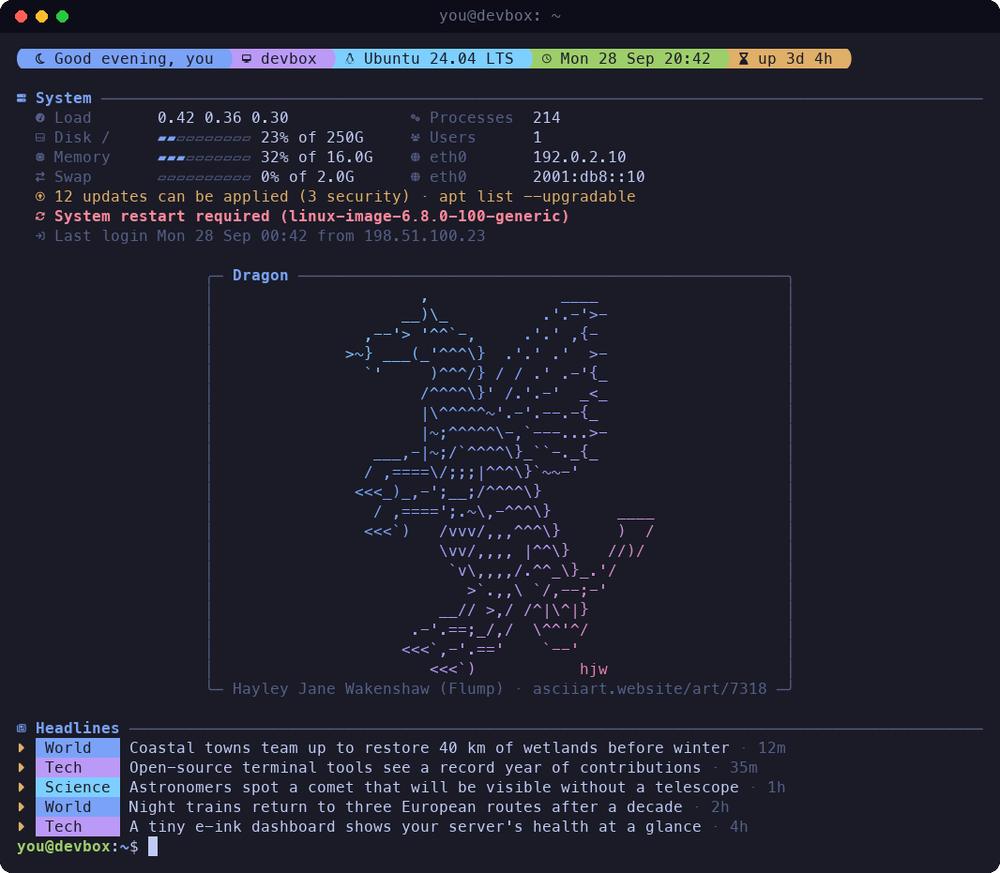
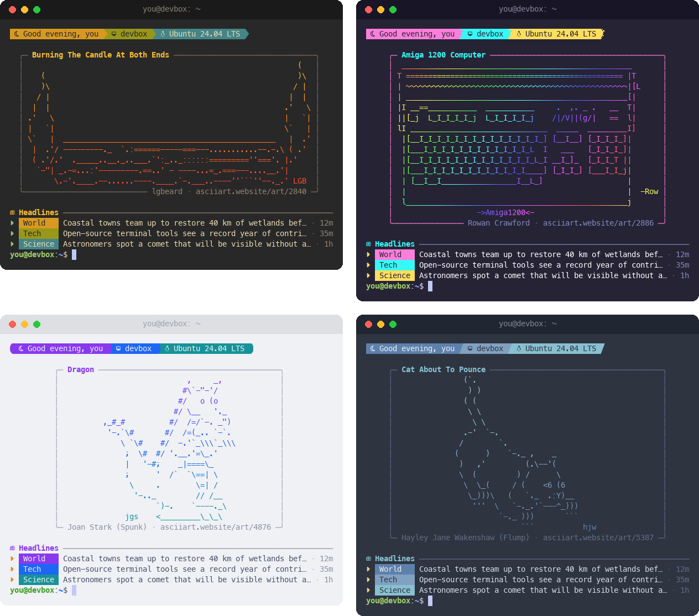
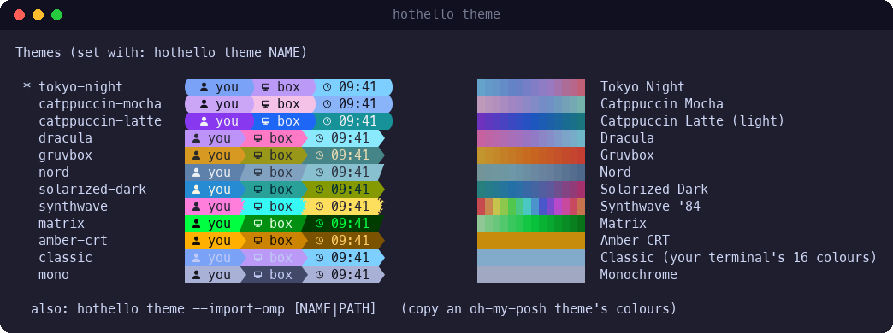
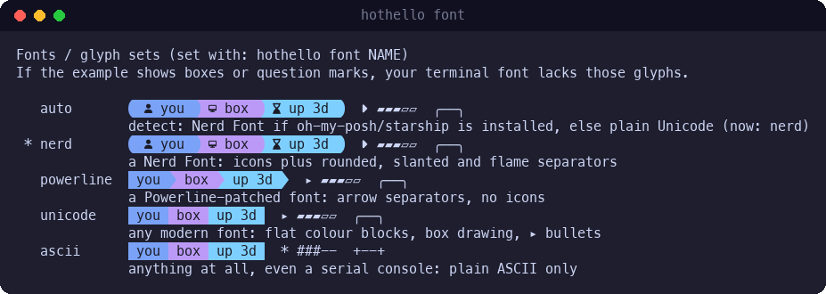
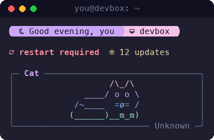
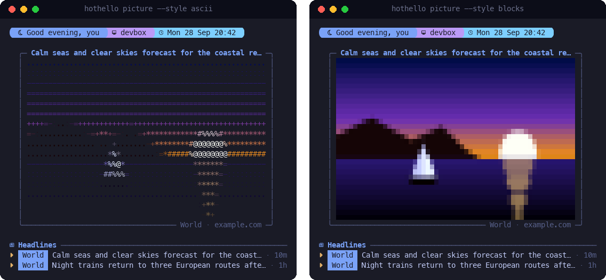
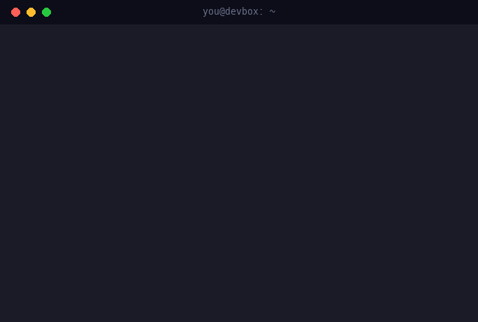
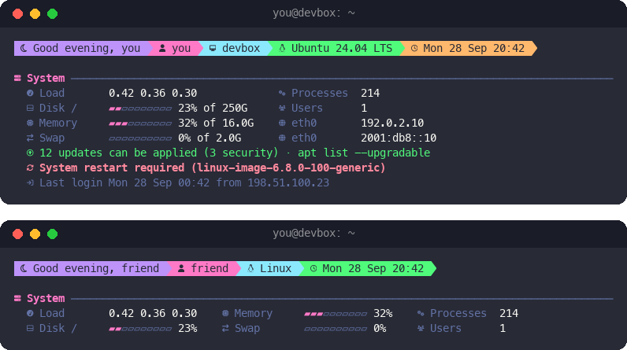
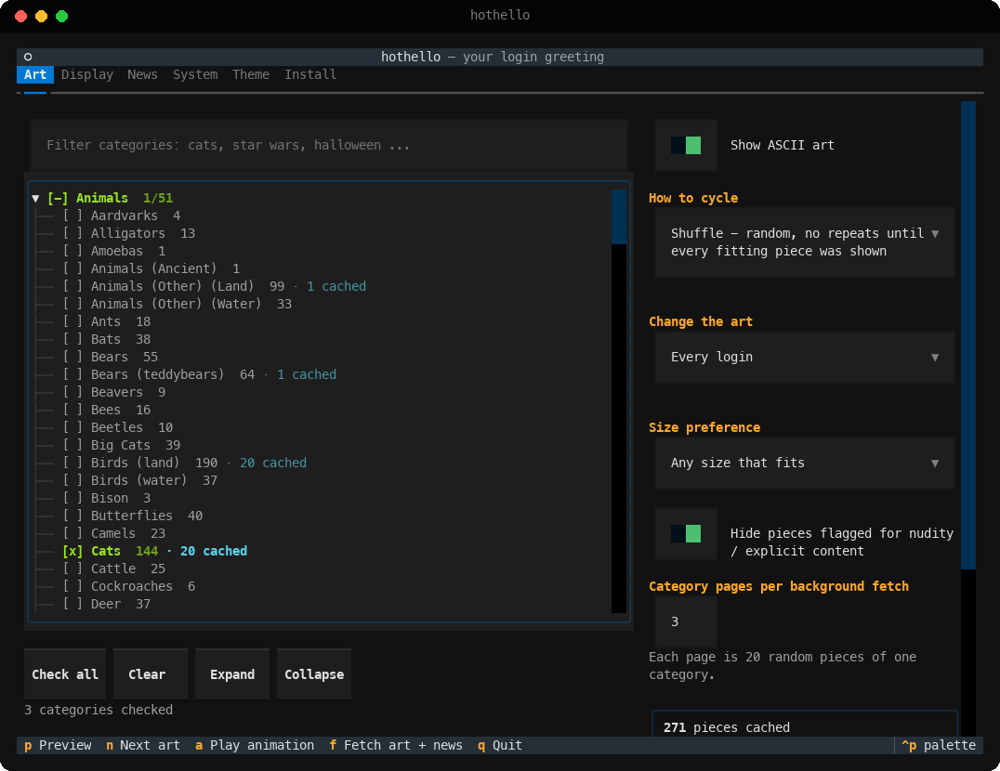
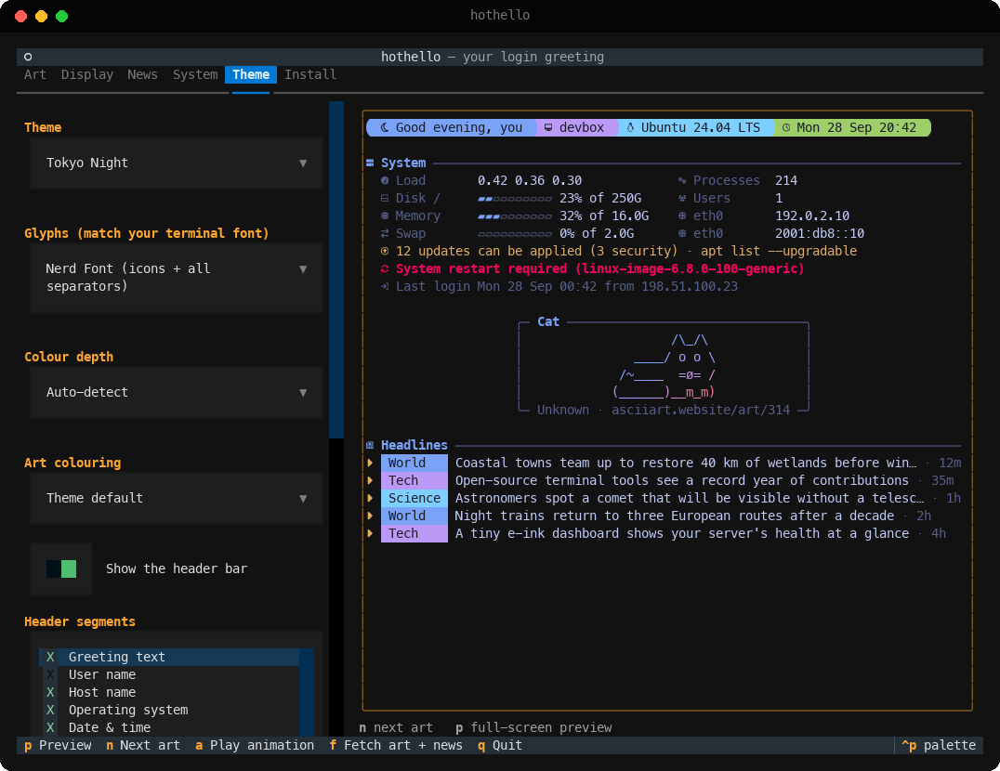

# hothello

A different piece of ASCII art every time you log in, picked from
[Christopher Johnson's ASCII Art Collection](https://asciiart.website/browse.php), with a quick system summary,
news headlines and an oh-my-posh-style header, all fitted to the size of your screen.



<sub>Screenshots use made-up machine details and placeholder headlines. The art is real and always credited.</sub>

## Install

```bash
git clone https://github.com/vantfindthe/hothello.git ~/hothello
cd ~/hothello
python3 -m venv .venv
.venv/bin/pip install -e .
.venv/bin/hothello install      # adds the login hook, then downloads a first batch of art and news
```

On Ubuntu, if `python3 -m venv` complains that `ensurepip` is missing, run `sudo apt install python3-venv`.
Without sudo you can use `python3 -m venv --without-pip .venv` and then
`curl -sSL https://bootstrap.pypa.io/get-pip.py | .venv/bin/python`.

To run `hothello` from anywhere, link it into a folder on your PATH:

```bash
ln -s ~/hothello/.venv/bin/hothello ~/.local/bin/hothello
```

Then open the settings UI with `hothello`, or change things from the command line (see [Commands](#commands)).

### Windows (PowerShell)

```powershell
git clone https://github.com/vantfindthe/hothello.git D:\hothello
cd D:\hothello
python -m venv .venv
.venv\Scripts\pip install -e .
.venv\Scripts\hothello install
```

* The greeting goes into your PowerShell profile (`Documents\WindowsPowerShell\profile.ps1`, plus
  `Documents\PowerShell\profile.ps1` when PowerShell 7 is installed). That file runs before
  `Microsoft.PowerShell_profile.ps1`, so the greeting appears above an oh-my-posh or starship prompt.
* It also adds a `hothello` command to PowerShell, so you don't need to change your PATH.
* It only greets interactive sessions. Scripts (`powershell -File`, `-Command`) and `-NonInteractive`
  runs stay silent.
* If your profile never runs, PowerShell's execution policy is blocking scripts; allow your own with
  `Set-ExecutionPolicy -Scope CurrentUser RemoteSigned`.
* Use Windows Terminal (or another modern terminal) for colours and Nerd Font glyphs.
* On Windows the System section shows disk, memory, processes, your IP address and uptime, plus
  "restart required" when Windows Update is waiting for a reboot.

Tested on Ubuntu 24.04 (bash) and Windows 11 (Windows PowerShell 5.1). Hooks for zsh, fish, PowerShell 7 and a
system-wide `/etc/update-motd.d` script are included too.

## What it shows

* **Art** from about 630 categories, cycled so nothing repeats until you've seen everything that fits.
  Pieces the site flags as nudity or explicit are skipped by default.
* **A header bar** with a greeting, host, OS, date and time, and uptime.
* **A System section**, a themed version of Ubuntu's login message: load, disk, memory and swap with usage bars,
  processes, users, IP addresses, pending updates, *restart required*, new-release notices and your last login.
  `hothello on hushlogin` hides Ubuntu's plain version so it isn't shown twice.
* **News headlines** from 37 built-in feeds (BBC, NPR, The Guardian, NYT, Al Jazeera, DW, PBS, The Economist,
  Ars Technica, Nature, NASA and more) or your own RSS/Atom feeds, interleaved so no single source dominates.
* **Optionally, the top story's picture as ASCII art** in place of the collection art (see
  [News pictures](#news-pictures-as-ascii-art)).

### Themes



Twelve built-in themes, each with header colours, an art gradient or rainbow, and frame and text colours.
`hothello theme` lists them all with a live sample, and `hothello theme --import-omp` builds a theme from the
colours of your oh-my-posh prompt.



> **Themes only colour hothello's own output.** hothello never changes your terminal's colour scheme,
> background or font, and it doesn't touch your shell prompt (oh-my-posh, starship or anything else).
> A theme decides the colours of the text *hothello prints* when you log in (and in its previews), and that's
> all. The prompt that follows looks exactly as it did before.
>
> * Most themes assume a dark terminal background; **Catppuccin Latte** is made for light ones.
> * **Classic** uses your terminal's own 16-colour palette, so it follows whatever colour scheme your terminal has.
> * `--import-omp` only *reads* your oh-my-posh config to copy its colours into a new hothello theme;
>   your oh-my-posh setup isn't modified.
> * The settings UI itself uses its own fixed look; the Theme tab's preview shows how your greeting will look.

### Fonts and glyphs



hothello doesn't install or change fonts. Your terminal draws the text with whatever font it's set to use, on
the machine you're sitting at. What hothello *can* choose is which symbols it prints:

| Glyph set | Needs | You get |
|---|---|---|
| `nerd` | a [Nerd Font](https://www.nerdfonts.com/) | icons (clock, host, memory ...) and rounded, slanted or flame separators |
| `powerline` | a Powerline-patched font | arrow separators, no icons |
| `unicode` | any modern font | flat colour blocks, box-drawing frames, ▸ bullets |
| `ascii` | anything, even a serial console | plain ASCII frames (`+--+`), `*` bullets, `#` bars |

* **`auto` (the default)** picks `nerd` when oh-my-posh or starship is installed on the machine *running
  hothello* (they need a Nerd Font too), or when `NERD_FONT=1` is set; otherwise it picks `unicode`.
* **Over SSH** the server can't see your local font, and prompt tools usually aren't installed there, so `auto`
  settles on `unicode`. If your terminal uses a Nerd Font, run `hothello font nerd` once on the server.
* **Boxes or question marks** in `hothello font` mean your font is missing those symbols. Pick the richest set
  that draws cleanly.
* **The art is plain text** and looks right in any monospace font. Glyph sets only change the decorations
  around it.
* **Colour depth** works the same way: `auto` reads what the terminal reports, but SSH usually doesn't pass on
  truecolor support, so you may get 256 colours. If gradients look banded, run `hothello color truecolor`.

### Fits any screen



Everything (header, system summary, framed art, headlines and a couple of rows for your prompt) is budgeted
into the screen size: your terminal's real size, fixed presets from 40x12 (phones and small SSH panes) up to
200x60, or a custom size. Art that doesn't fit isn't chosen (if nothing cached fits, the closest piece is
centre-cropped, or skipped if you prefer). On short screens the headlines go first, then
the system grid folds into a single alert line, so the art keeps its room and "restart required" stays visible.

<br clear="right">

### News pictures as ASCII art



<sub>An original drawing with a placeholder headline; real news photos belong to their publishers.</sub>

`hothello picture on` replaces the collection art with the picture of the top headline, turned into ASCII art.

* **Where the picture comes from:** the background refresh takes it from the feed when there is one (BBC, The
  Guardian, Ars Technica, NYT and others include pictures), otherwise from the article's own preview image. It
  fetches the top three stories, shrinks each picture to a small grid and caches it, so logging in still never
  waits on the network.
* **Styles:** `ascii` draws it with characters chosen by brightness. `blocks` uses half-block "pixels", which
  look more like the photo.
* **Colours:** the picture's own colours, your theme's, or none (`--color image|theme|mono`).
* **Size:** it's fitted to the space the art gets, at most `--width` columns (64 by default).
* **Credit:** the frame shows the headline and credits the outlet, with a link to the article.
* **Fallback:** if none of the top stories has a picture, the usual collection art is shown.

Turning images into characters uses [Pillow](https://python-pillow.org/), which is installed with hothello.

### Login animations



Optional effects that reveal the greeting: `lines`, `slide` (right to left), `wipe`, `rain`, `decode`, `nuke`
or `random`. Try one with `hothello animation nuke --try`. Any key skips the animation, and it only runs when
the output is a terminal. Only changed characters are redrawn, so it stays light over SSH. The real text is
printed at the end, so scrollback and links are intact.

### Privacy mode, for screen recordings



`hothello privacy on` hides your user and host names, IP addresses, the last-login address, OS and kernel
versions, uptime, memory and disk totals, and patch status (pending updates and "restart required" tell
people how up to date a machine is). Use `HOTHELLO_PRIVACY=1` or `hothello preview --private` for a single
session.

## The settings UI

<p>


</p>

| Tab | What you control |
|---|---|
| **Art** | Collection art or the top story's picture (style, colours, width), which categories to cycle (Space checks a category or a whole group; nothing checked means all), shuffle / rotate / random, every login / hourly / daily, prefer bigger pieces, hide flagged content, fetch more now |
| **Display** | Screen size presets or a custom size, smallest art worth showing, rows kept for your prompt, frame style, alignment, crop or skip when nothing fits, art name and source on or off, login animation |
| **News** | Built-in feeds, your own feeds (checked before they're added), how many headlines, per-source cap, max age, refresh interval, clickable links |
| **System** | Which facts to show, alerts, last login, usage bars, hiding the system's own login message, privacy mode |
| **Theme** | Theme, glyph set, colour depth, art colouring, header segments, greeting, date format, timezone, oh-my-posh import |
| **Install** | Login hooks for bash, zsh, fish and PowerShell, and the system-wide `/etc/update-motd.d` hook |

Keys: `p` full-screen preview at your real terminal size · `a` play the animation · `n` next art ·
`f` fetch art and news · `q` quit.

## Commands

Everything in the settings UI can also be done from the command line. Commands that take a choice show the
options with a live example when you leave the choice off, and accept any unique prefix (`hothello theme gruv`).

```
hothello                         settings UI (also: hothello config)
hothello show | preview          print the greeting; preview doesn't use up the art
                                 --private, --animate STYLE, --no-animate, --width/--height, --color, --glyphs

hothello features                every feature and whether it's on
hothello on|off|toggle NAME ...  show / hide features:  art headlines system header title credit frame
                                 badges ages links bars alerts lastlogin network privacy animation color
                                 picture flagged hushlogin   (e.g.  hothello off headlines credit)

hothello privacy [on|off]        privacy mode for recordings  (--alias NAME)
hothello theme [NAME]            themes with examples  (--import-omp [NAME|PATH] for oh-my-posh)
hothello font [NAME]             glyph sets with examples: auto, nerd, powerline, unicode, ascii
hothello color [MODE]            colour depth with examples: auto, truecolor, 256, 16, none
hothello frame [STYLE]           frames with examples
hothello size [NAME|WxH]         screen size presets, or a custom size like 100x30
hothello cycle [MODE]            shuffle | rotate | random  --every login|hourly|daily  --prefer any|large
hothello categories [SEARCH]     --add / --remove / --only NAME|GROUP|ID ...   --clear   --selected
hothello feeds                   --add ID|URL  --remove ID|URL  --name NAME
hothello picture [on|off]        the top story's picture as ASCII art  --style ascii|blocks
                                 --color image|theme|mono  --width N
hothello headlines               --count N  --per-source N  --max-age HOURS
hothello animation [STYLE]       none lines slide wipe rain decode nuke random  --speed  --target all|art  --try
hothello greeting [TEXT]         e.g.  hothello greeting 'Hey {user}, {greeting}!'
hothello get [KEY] | set KEY VALUE | reset [SECTION] --yes

hothello refresh                 fetch art and headlines now (--art, --news, --catalog)
hothello status                  paths, cache size, feed health, hook status
hothello install | uninstall     [--target bash|zsh|fish|pwsh|powershell|update-motd] [--hushlogin]
```

Config lives in `~/.config/hothello/config.json` (your own themes in `themes/`), and the cache in
`~/.cache/hothello/hothello.db`. On Windows they're in `%APPDATA%\hothello` and `%LOCALAPPDATA%\hothello`.

## How it works

* **At login** the hook runs `hothello show`, which reads the local cache, prints, and exits in a fraction of a
  second (about 0.1 s on Linux, 0.2 s on Windows, where Python itself starts more slowly). It never touches the network and never breaks your login: errors are swallowed (set
  `HOTHELLO_DEBUG=1` to see them). It only runs in interactive shells, so `ssh host cmd`, scp and deploy scripts
  are unaffected.
* **In the background** it starts a detached `hothello refresh --if-due` when the news is older than the
  refresh interval, when unseen art that fits is running low, or when you pick categories it hasn't fetched yet.
* **Art** comes from the site's public category pages, each of which serves 20 random pieces. It fetches a few
  pages at a time, pauses between requests and identifies itself honestly. The cache grows gradually.

## System-wide (every user, via pam_motd)

```bash
sudo ~/hothello/.venv/bin/python -m hothello install --target update-motd
```

This copies your config to `/var/lib/hothello` and adds `/etc/update-motd.d/60-hothello`. pam_motd has no
terminal to measure, so choose a fixed size (for example Classic 80x24) first.

## Tests

```bash
.venv/bin/pip install -e ".[dev]" && .venv/bin/pytest
```

## Credits

The art is © its artists, is credited on every greeting with a link back to asciiart.website, and comes from
Christopher Johnson's ASCII Art Collection. Headlines belong to their publishers and link to the original
articles.
